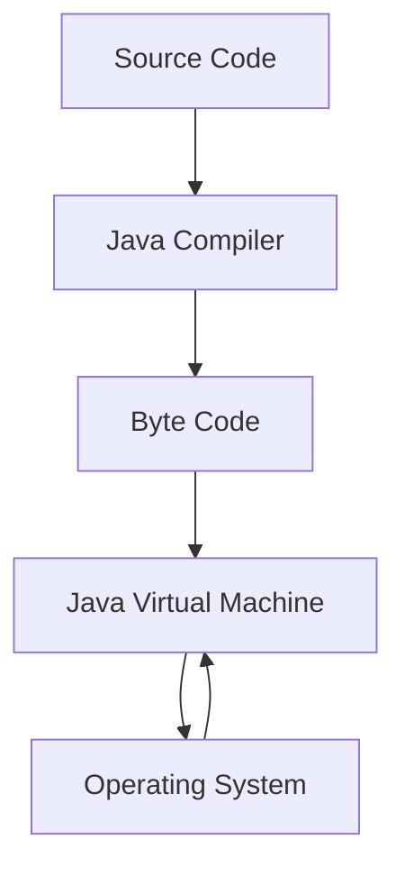

# Java Architecture

### Overview of how Java Works internally
- The source code gets converted into Byte Code by Java Compiler.
- The Byte Code gets converted into machine code by the JVM.
- Then the machine (os) directly runs the machine code.

## Java Components
There are three main components of Java language: JVM (Java Virtual Machine), JRE (Java Runtime E), and JDK.
