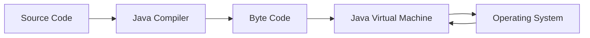
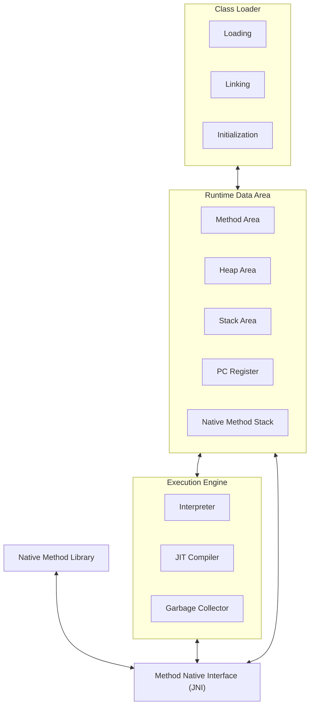

# Java Architecture

### Overview of how Java Works internally
- The **Source Code** gets converted into **Byte Code** by *Java Compiler*.
- The **Byte Code** gets converted into **Machine code** by the *JVM*.

## Java Components
There are three main components of Java language: **JVM** (Java Virtual Machine), **JRE** (Java Runtime Environment), and **JDK** (Java Development Kit).

## Java Virtual Machine
The Java Virtual Machine (JVM) is an execution environment that operates independently of the platform. **It translates Java bytecode into machine code and executes it on the host operating system.**

The JVM offers a uniform runtime environment across various platforms, guaranteeing that Java applications can operate on any system equipped with a compatible JVM.

The principle of "Write Once, Run Anywhere" (WORA), a fundamental aspect of Java development, enables this cross-platform compatibility.

## JVM Architecture

